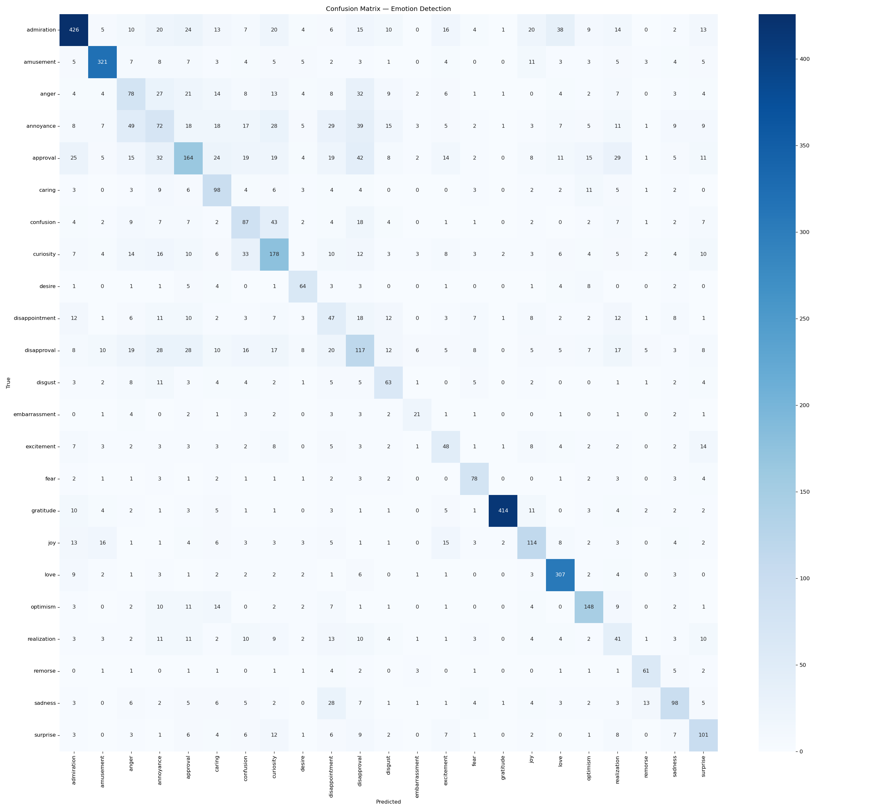

<div align="center">

# 🎭 Emotion Text Detection

### Detect the Emotion Hidden in Any Text — Instantly

**AI-powered sentiment analysis across 6 core human emotions, built with TF-IDF + Logistic Regression and served via a sleek Streamlit web app.**

<br/>

[](https://www.python.org/)
[](https://streamlit.io/)
[](https://scikit-learn.org/)
[](https://huggingface.co/datasets/dair-ai/emotion)
[](https://github.com/LIkith1226/EMOTIONDETECTION)

<br/>

*Created by **Likith Abhiram Jaldu** and **Vishwanath Reddy***

</div>

---

## 📽️ Demo

> 🎬 **Watch the app in action:**


 


---

## 📖 Table of Contents

- [Overview](#-overview)
- [Features](#-features)
- [How It Works](#-how-it-works)
- [The 6 Emotions](#-the-6-emotions)
- [Project Structure](#-project-structure)
- [Installation](#-installation)
- [Usage](#-usage)
- [Model Performance](#-model-performance)
- [Dataset](#-dataset)
- [Tech Stack](#-tech-stack)
- [Known Limitations](#-known-limitations)
- [Future Improvements](#-future-improvements)
- [Authors](#-authors)

---

## 🧠 Overview

**Emotion Text Detection** is a machine learning web application that identifies the **emotional tone** of any text input — from tweets and product reviews to personal messages and customer support tickets.

Paste any sentence and the app will:
- **Classify it** into one of 6 core human emotions
- **Display a confidence score** for the winning emotion
- **Show a full probability breakdown** across all 6 emotions
- **Explain its reasoning** by surfacing the top vocabulary signals that most influenced the prediction

The model is trained on the [`dair-ai/emotion`](https://huggingface.co/datasets/dair-ai/emotion) dataset — **~16,000 real-world Twitter texts** — and achieves **92%+ accuracy** on the held-out test set, a massive leap from earlier versions that used the noisier GoEmotions dataset.

---

## ✨ Features

| Feature | Description |
|---|---|
| 🎯 **6-Emotion Classification** | Detects sadness, joy, love, anger, fear, and surprise |
| 📊 **Full Probability Breakdown** | Confidence scores for all 6 emotions, not just the winner |
| 🔍 **Vocabulary Signal Explorer** | Shows which words most influenced the model's decision |
| 🧪 **Built-in Example Sentences** | 6 pre-loaded examples for instant exploration |
| ⚡ **Sub-second Inference** | Lightweight TF-IDF + Logistic Regression — no GPU required |
| 💾 **Cached Pre-trained Model** | `emotion_model.pkl` ships with the repo — run immediately, no training needed |
| 🌐 **Offline Fallback** | Falls back to local CSV if HuggingFace is unreachable |
| 🎨 **Modern UI** | Orange-branded Streamlit interface with a unique colour per emotion |

---

## ⚙️ How It Works

The pipeline has three stages, each handled by a dedicated module:

### Stage 1 — Text Preprocessing (`data_preprocessing.py`)

Raw text is cleaned identically at **both training and inference time**, ensuring full consistency:

```
Raw Input
  ↓  Lowercase
  ↓  Strip URLs and Reddit references (r/..., u/...)
  ↓  Remove profanity used as intensifiers
  ↓  Remove punctuation   ("don't" → "dont")
  ↓  Negation handling    ("dont care" → "dont_care")
  ↓  Collapse whitespace
Clean Text
```

**Why negation handling matters:** Without it, `"I do not love this"` gets dominated by the word *love* and misclassifies as **joy**. By merging `not <word>` into a single token `not_word`, the TF-IDF vectoriser learns that `not_love` is a strong signal for **sadness** or **anger** — not love.

---

### Stage 2 — TF-IDF Vectorisation

**TF-IDF** (Term Frequency — Inverse Document Frequency) converts clean text into a numeric feature vector that the classifier can learn from:

- **TF** — how often a word appears in *this specific document*
- **IDF** — log(N / df) — penalises words that appear across *many* documents (common filler)
- **TF-IDF** = TF × IDF → emotionally charged words score high; generic words score near zero

| Parameter | Value | Reason |
|---|---|---|
| `max_features` | 15,000 | Focused vocabulary; reduces overfitting |
| `ngram_range` | (1, 2) | Captures bigrams: *"love you"*, *"not happy"*, *"can't stand"* |
| `sublinear_tf` | True | Dampens impact of words repeated many times |
| `min_df` | 2 | Drops words seen only once (noise) |
| `max_df` | 0.95 | Drops near-universal filler words |
| `norm` | `l2` | Normalises vectors for comparable dot products |

---

### Stage 3 — Logistic Regression Classifier

A **Multinomial Logistic Regression** maps the TF-IDF vector to a probability distribution over the 6 emotion classes:

| Parameter | Value | Reason |
|---|---|---|
| `multi_class` | `multinomial` | True multi-class softmax (not one-vs-rest) |
| `class_weight` | `balanced` | Corrects for natural class imbalance in the dataset |
| `C` | 1.0 | Standard L2 regularisation strength |
| `solver` | `lbfgs` | Efficient, memory-friendly for multi-class |
| `max_iter` | 3,000 | Guarantees full convergence |

The model outputs a **probability vector** over all 6 emotions. The argmax is the predicted emotion; all 6 scores are returned for the breakdown visualisation.

---

## 🎭 The 6 Emotions

| Emotion | Colour | Sample Text |
|---|---|---|
| 😢 **Sadness** | `#3B82F6` Blue | *"I feel so sad and I miss them so much. The pain is unbearable."* |
| 😄 **Joy** | `#F59E0B` Amber | *"I am so happy I got the job! Best day of my life!"* |
| 💗 **Love** | `#EC4899` Pink | *"I love you so much. You mean everything to me."* |
| 😠 **Anger** | `#EF4444` Red | *"I hate this so much. I am so angry right now."* |
| 😨 **Fear** | `#9333EA` Purple | *"I am so scared and terrified. I cannot stop shaking."* |
| 😲 **Surprise** | `#C026D3` Fuchsia | *"Wow! I cannot believe this happened. I am completely shocked!"* |

---

## 📁 Project Structure

```
EMOTIONDETECTION/
│
├── app.py                    # 🖥️  Streamlit web application
│                             #     UI layout, colour palette, HTML components,
│                             #     input handling, result cards & example buttons
│
├── model.py                  # 🤖  ML pipeline (training + inference)
│                             #     build_pipeline()          → TF-IDF + LR
│                             #     train_and_evaluate()      → full training loop
│                             #     predict_emotion()         → single-text inference
│                             #     get_top_words_for_emotion() → interpretability
│
├── data_preprocessing.py     # 🔧  Dataset loading, filtering & text cleaning
│                             #     load_emotions_from_hf()   → HuggingFace loader
│                             #     load_from_local_csv()     → offline fallback
│                             #     preprocess_text()         → cleaning pipeline
│                             #     prepare_data()            → public entry point
│
├── emotion_model.pkl         # 💾  Pre-trained serialised pipeline (joblib)
├── processed_data.csv        # 📊  Cached preprocessed training data
├── confusion_matrix.png      # 📈  Confusion matrix heatmap from last training run
├── tweet_emotions.csv        # 📂  Local CSV dataset (offline fallback)
│
├── requirements.txt          # 📦  Python dependencies
└── UPDATES.md                # 📝  Project changelog & version history
```

---

## 🚀 Installation

### Prerequisites

- **Python 3.10+**
- **pip**

### Step 1 — Clone the repository

```bash
git clone https://github.com/LIkith1226/EMOTIONDETECTION.git
cd EMOTIONDETECTION
```

### Step 2 — Create a virtual environment *(recommended)*

```bash
# macOS / Linux
python3 -m venv venv
source venv/bin/activate

# Windows
python -m venv venv
venv\Scripts\activate
```

### Step 3 — Install dependencies

```bash
pip install -r requirements.txt
```

<details>
<summary><strong>Full dependency list</strong></summary>

```
pandas>=1.5.0
numpy>=1.23.0
scikit-learn>=1.2.0
streamlit>=1.28.0
datasets>=2.14.0
joblib>=1.3.0
matplotlib>=3.7.0
seaborn>=0.12.0
```

</details>

---

## 🖥️ Usage

### ▶ Option A — Launch the Web App *(fastest)*

The repo ships with a **pre-trained `emotion_model.pkl`**, so no training is needed:

```bash
streamlit run app.py
```

Open `http://localhost:8501` in your browser. Paste any text, hit **Detect Emotion →**, and explore the results.

---

### 🔁 Option B — Retrain the model from scratch

```bash
python model.py
```

This will:
1. Download the `dair-ai/emotion` dataset from HuggingFace *(or use local CSV if offline)*
2. Preprocess and cache data to `processed_data.csv`
3. Train the TF-IDF + Logistic Regression pipeline
4. Print a full classification report & accuracy
5. Save `confusion_matrix.png`
6. Serialise the pipeline to `emotion_model.pkl`

---

### 🐍 Option C — Use the model in your own code

```python
from model import load_model, predict_emotion

# Load the pre-trained pipeline
pipeline = load_model()

# Predict on any English string
text = "I just got the promotion I've been working towards for years!"
emotion, confidence, all_probs = predict_emotion(text, pipeline)

print(f"Emotion    : {emotion}")           # → joy
print(f"Confidence : {confidence:.1%}")    # → 97.3%
print(f"All probs  : {all_probs}")
# → {'sadness': 0.007, 'joy': 0.973, 'love': 0.008, 'anger': 0.004, 'fear': 0.005, 'surprise': 0.003}
```

---

### 🔑 Option D — Explore top vocabulary signals

```python
from model import load_model, get_top_words_for_emotion

pipeline = load_model()

# Get the 12 words the model associates most strongly with "anger"
words = get_top_words_for_emotion("anger", pipeline, n=12)
print(words)
# → ['hate', 'angry', 'furious', 'mad', 'outraged', 'annoyed', ...]
```

---

## 📈 Model Performance

| Metric | Value |
|---|---|
| **Test Accuracy** | **92%+** |
| **Training samples** | ~12,800 |
| **Test samples** | ~3,200 |
| **Number of classes** | 6 |
| **Model size** | ~4.3 MB (`emotion_model.pkl`) |

### Confusion Matrix



The heatmap is regenerated automatically each time you run `python model.py`. The diagonal represents correct classifications. The most frequent confusion is between **sadness** and **fear**, which share overlapping vocabulary (e.g., *"alone"*, *"lost"*, *"can't"*).

### Version-over-version improvement

| Version | Dataset | Emotions | Accuracy |
|---|---|---|---|
| v1.0 | GoEmotions — Reddit | 23 | ~54% |
| **v2.0** | **dair-ai/emotion — Twitter** | **6** | **92%+** |

The dramatic accuracy jump comes from reducing label space from 23 highly overlapping emotions to 6 well-separated core ones, and from moving to a more appropriate dataset for short-text classification.

---

## 📊 Dataset

| Property | Value |
|---|---|
| **Name** | [dair-ai/emotion](https://huggingface.co/datasets/dair-ai/emotion) |
| **Source** | Twitter / X |
| **Total samples** | ~16,000 |
| **Splits available** | train / validation / test |
| **Labels** | 6: sadness, joy, love, anger, fear, surprise |
| **Language** | English |
| **License** | Apache 2.0 |

The dataset is downloaded automatically at training time. If HuggingFace is unreachable, the loader falls back to `tweet_emotions.csv` bundled in the repository.

---

## 🛠️ Tech Stack

| Layer | Technology | Purpose |
|---|---|---|
| **ML / NLP** | [Scikit-learn](https://scikit-learn.org/) | TF-IDF vectorisation + Logistic Regression |
| **Web App** | [Streamlit](https://streamlit.io/) | Zero-boilerplate Python UI |
| **Data Handling** | [Pandas](https://pandas.pydata.org/), [NumPy](https://numpy.org/) | DataFrame manipulation & array ops |
| **Dataset** | [HuggingFace Datasets](https://huggingface.co/docs/datasets) | `dair-ai/emotion` download & splits |
| **Visualisation** | [Matplotlib](https://matplotlib.org/), [Seaborn](https://seaborn.pydata.org/) | Confusion matrix heatmap |
| **Model I/O** | [Joblib](https://joblib.readthedocs.io/) | Fast pipeline serialisation |
| **Language** | Python 3.10+ | — |

---

## ⚠️ Known Limitations

| Limitation | Detail |
|---|---|
| 🎭 **Sarcasm** | Not detected. *"Oh great, another Monday"* may misclassify as joy. |
| 📝 **Very short inputs** | Single words give low-confidence, unreliable results. |
| 🔀 **Mixed emotions** | Only one label is returned per input, even when multiple emotions are present. |
| 🌍 **English only** | Trained on English text. Other languages produce unreliable output. |
| 🐦 **Twitter-length bias** | Optimised for short texts; very long formal documents may underperform. |

---

## 🚧 Future Improvements

- [ ] Cross-validation for more robust evaluation metrics
- [ ] Multi-label emotion output (return *all* emotions present, not just the top one)
- [ ] Sarcasm and irony detection layer
- [ ] REST API endpoint (FastAPI) for programmatic access
- [ ] Multilingual support via multilingual sentence embeddings
- [ ] Transformer-based model (e.g., DistilBERT fine-tuned on `dair-ai/emotion`) for higher accuracy
- [ ] Fine-tune on additional Twitter and social-media corpora
- [ ] Docker container for one-command deployment

---

## 👥 Authors

<table>
  <tr>
    <td align="center" width="50%">
      <br/>
      <b>Likith Abhiram Jaldu</b>
      <br/>
      <a href="https://github.com/LIkith1226">@LIkith1226</a>
    </td>
    <td align="center" width="50%">
      <br/>
      <b>Vishwanath Reddy Ninganolla</b>
      <br/>
      (Co-Developer)
      <a href="https://github.com/523vishwanath">@523vishwanath</a>
    </td>
  </tr>
</table>

---

## 📄 License

This project is open-source. Refer to the repository for full licensing details.

---

<div align="center">

**EmotionText Detection** — *Understanding feelings, one sentence at a time.*

<br/>

⭐ **If you found this project helpful, please give it a star — it helps others discover it!**

<br/>

*Built with ❤️ using Scikit-learn · Streamlit · dair-ai/emotion Dataset*

</div>
